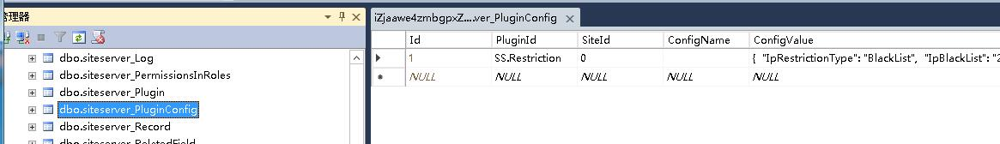

## 设置错误导致无法进入系统后台怎么办？

如果设置了不允许某个IP访问，或者只允许某些IP访问之后，或者只允许某个域名访问，而此IP或域名暂又无法使用的情况下，导致无法进入系统后台，此时应该如何处理呢？

以MsSqlServer数据库为例，打开数据库找到表：siteserver_PluginConfig，右键表名弹出子菜单，选择 “编辑前200行”，找到PluginId为 "SS.Restriction" 的记录，然后编辑对应字段 “ConfigValue”的值，把相应的限制按以下方法去掉即可。如下图所示：

+ **关闭IP限制功能：** 修改成："IpRestrictionType":"None”，就可以把IP限制的功能关闭；
+ **关闭域名访问限制功能：** 修改成："IsHostRestriction":"false"，就可以把域名访问限制功能关闭。
