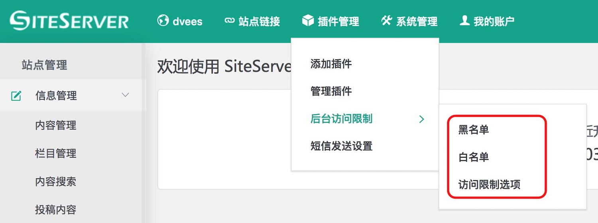
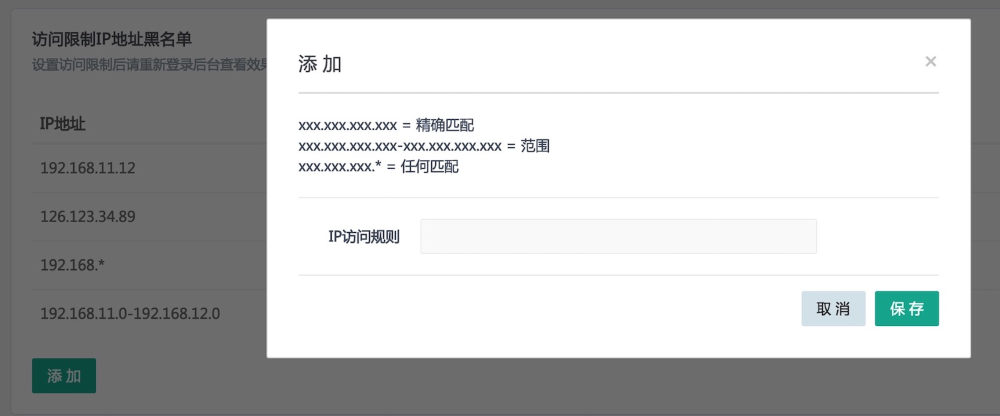
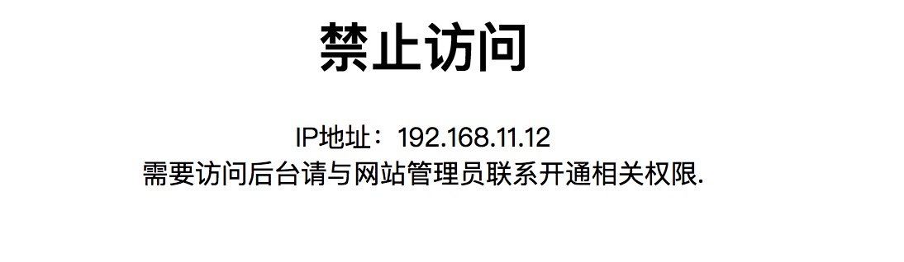

## 插件的使用

SiteServer CMS 后台访问限制插件安装好之后，在 “插件管理” 子菜单中会多出一个 “后台访问限制” 菜单，鼠标移上去之后可以看到有三个子菜单，如下图所示：

首先要设置的是访问限制选项，然后如果开启了黑名单或白名单功能选项，才需要进一步到设置 “黑名单” 或 “白名单” 菜单中进行相应的参数设置。

### 访问限制选项

要想正确使用本插件，第一个需要进行配置的就是 “访问限制选项” ，因为在这里可以设置是否开启访问限制功能。如下图所示：

+ **无访问限制：** 如果选择无访问限制，意味着本插件功能不启用，所以黑白名单怎么设置也不会起作用；

+ **启用黑名单：** 意味着黑名单里的所有IP地址都将不能访问本系统后台；

+ **启用白名单：** 意味着只有白名单里的所有IP地址能访问本系统后台，其他IP一律不让访问；

+ **管理后台域名限制：** 如果设置了本项，则意味着访问后的浏览器地址必须是 “管理后台访问域名” 项里设置好的，其他地址一概不能正常打开后台。

+ **管理后台访问域名：** 如果前一项 “管理后台域名限制” 选择了 “设置” 选项，那么本选项设置才能起作用，意味着只有此访问域名才能正常进入后台，其他域名均无法进入系统后台。特别需要注意的是，如果访问域名带端口的话，则需要把端口也填写进去。

### 黑名单

准确来说应该是IP黑名单，在开启了黑名单功能的前提下，意味着下面IP列表里的所有IP或IP段，不允许访问系统后台。如下图所示：

具体IP的设置方法有三种，通过点击添加按钮可以看到：

+ xxx.xxx.xxx.xxx = 精确匹配，指定某个具体IP为黑名单；

+ xxx.xxx.xxx.xxx-xxx.xxx.xxx.xxx = 范围，指定某个IP段为黑名单；

+ xxx.xxx.xxx.* = 任何匹配，指定某一批符合表达式规则的IP为黑名单；

设置成功之后，比如黑名单里设置了IP：192.168.11.12，如果用在这台机器（IP为192.168.11.12）上访问系统后台，则会出现如下图所示效果：

### 白名单

在开启了白名单功能的前提下，只有白名单里IP列表里的IP才能正常访问系统后台，其他IP一概无法访问。具体设置可以参考黑名单的设置。